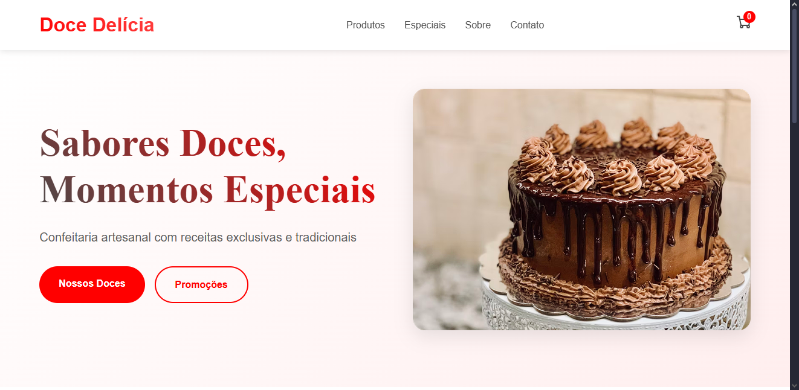
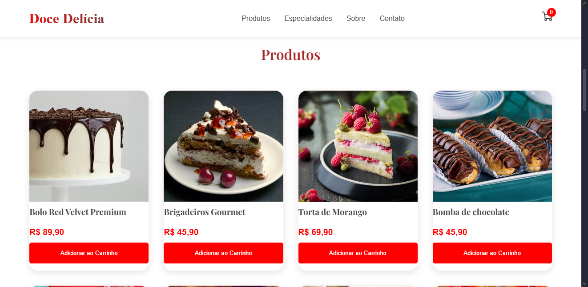
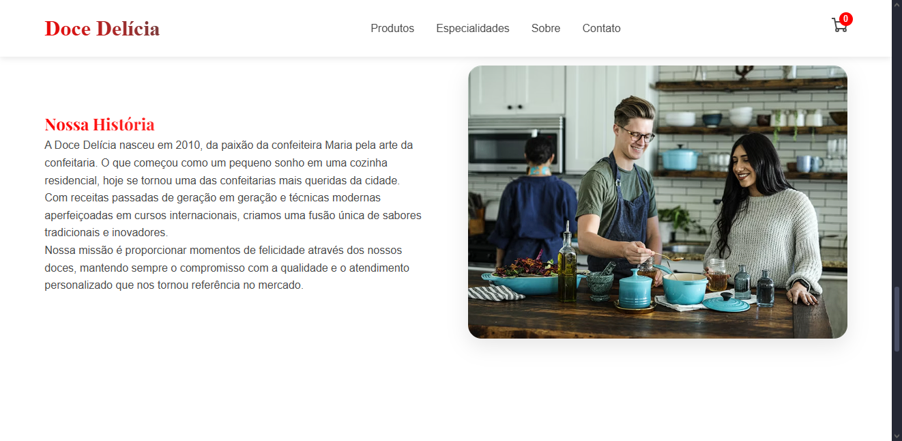
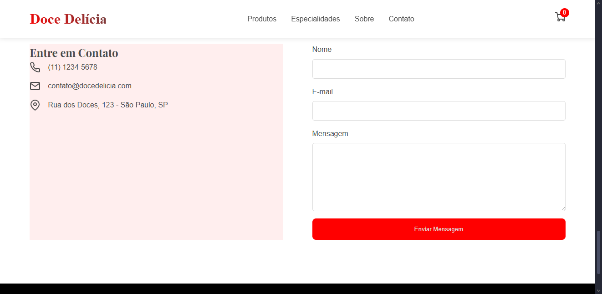

<p align="center">
  <a href="#-tecnologias">Tecnologias</a>&nbsp;&nbsp;&nbsp;|&nbsp;&nbsp;&nbsp;
  <a href="#-projeto">Projeto</a>&nbsp;&nbsp;&nbsp;|&nbsp;&nbsp;&nbsp;
  <a href="#-como-usar">Como usar</a>
</p>

<p align="center">
  
</p>

<p align="center">
  
</p>

---

## 🚀 Tecnologias

Esse projeto foi desenvolvido com as seguintes tecnologias:

- HTML5
- CSS3
- JavaScript (ES6+)
- React JS
- Vite

---

## 💻 Projeto

**Doce Delícia** é um projeto fictício de landing page para uma confeitaria artesanal.

O objetivo é apresentar os principais produtos da loja, contar sua história, exibir diferenciais e oferecer formas de contato — tudo em um layout moderno e responsivo.

### Funcionalidades:
- Scroll suave entre seções com `scrollIntoView()`
- Estilo global com CSS puro
- Componentização com React
- Layout 100% responsivo
- Separação clara entre estrutura e estilo

---

## 📦 Como usar

Depois de clonar ou baixar este repositório, abra o terminal e siga os passos:

```bash
# Instalar as dependências
npm install

# Iniciar o servidor de desenvolvimento
npm run dev

# Acesse no navegador
http://localhost:5173
```


Projeto desenvolvido com [Vite](https://vitejs.dev/) para performance e agilidade no desenvolvimento com React.
---

## 📸 Preview

Confira abaixo algumas imagens da interface do projeto:

### 🧁 Hero + Navegação


### 🎂 Produtos


### 🍓 Especialidades


### 👀 Sobre


### 🏠 Contato + Footer



## 🌐 Deploy

[](https://app.netlify.com/projects/docedeliciaa/deploys)

🔗 **Acesse o site aqui:**  
👉 https://docedeliciaa.netlify.app

---

Feito com ❤️ por **Felipe Alves** — Obrigado por visitar este projeto!
